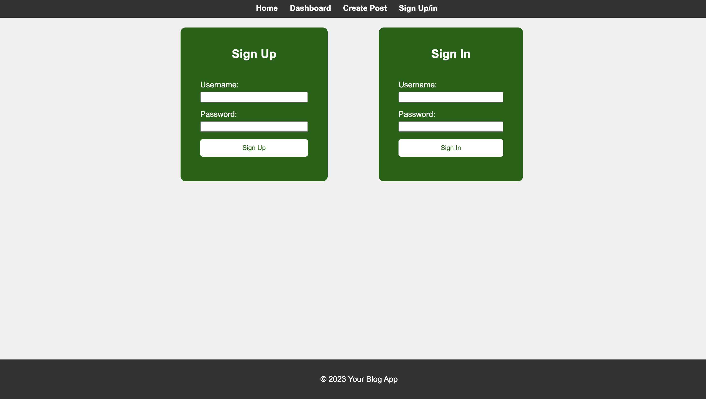

# nerdynarrative

## Description
Welcome to NerdyNarrative blog site designed for tech enthusiasts and developers! This dynamic platform allows you to seamlessly publish and share your articles, blog posts, and personal thoughts and opinions. Built with a user-centric approach, the application ensures a smooth experience from the initial visit to the creation and management of your content.

Website: https://nerdynarrative-2bc7a82fe5d3.herokuapp.com/

GitHub: https://github.com/JR728/nerdynarrative

## Usage
npm install
need .env file with the DB_NAME, DB_USER, DB_PASSWORD
go to MYSQl shell put command "SOURCE db/schema.sql;"
then type "quit"
type in terminal "npm run seed" to seed database
type "npm start" to start server
## Images

## Credits
Justin
## License
MIT
